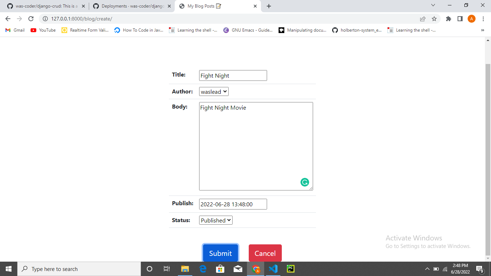
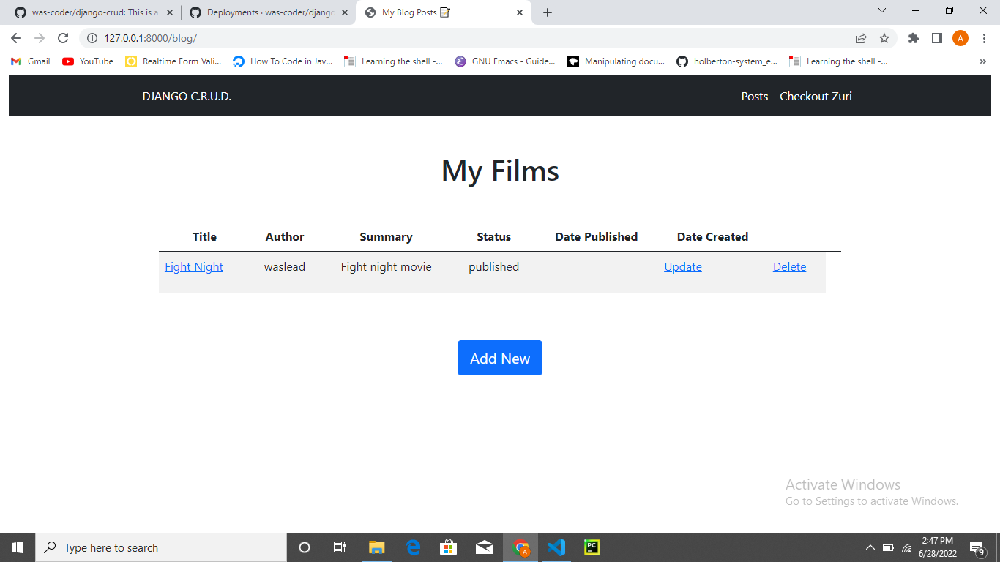

# Django Crud

> This is a django crud task

## Built With

- Python

## Images

## Live Demo

[Live Demo Link](https://was-coder.github.io/django-crud/)

## Note

- To view the admin page add /admin at the end of the url link
- To view the blog page add /blog at the end of the url link

## Style Guides

- [Git Style Guide](https://udacity.github.io/git-styleguide/)

## 👤 Author

- Github: [@was-coder](https://github.com/was-coder)
- Twitter: [@DevWaslead](https://twitter.com/DevWaslead)
- Linkedin: [@Adelakun Wasiu](https://www.linkedin.com/in/wasiu-adelakun-1a2a5b1a6/)

## Show your support

Give a ⭐️ if you like this project!
